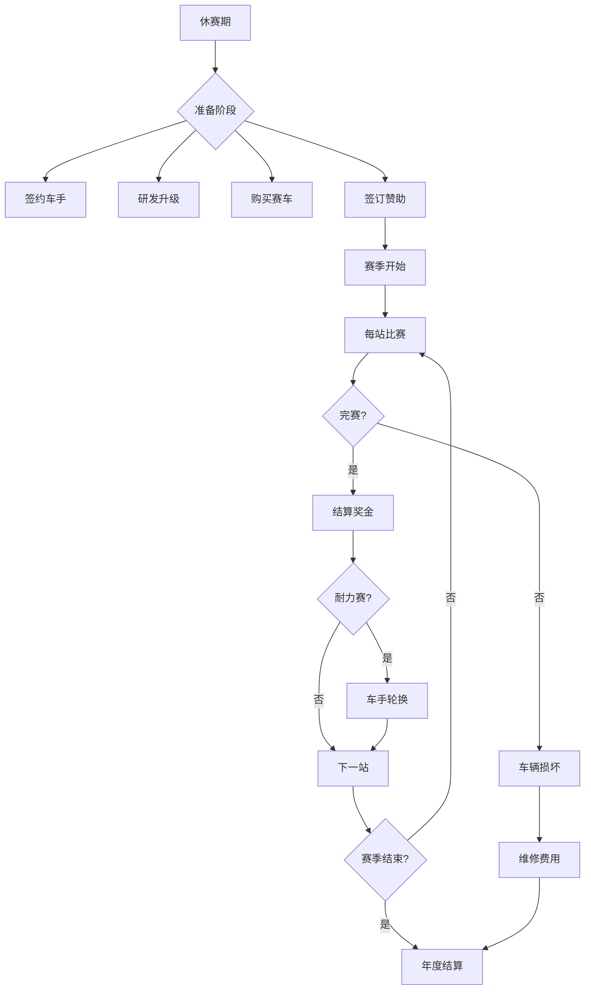
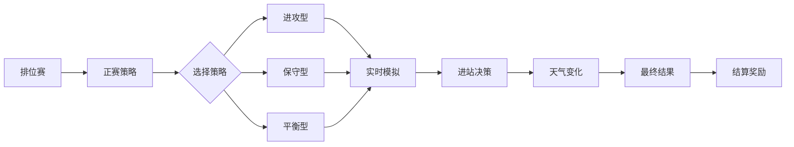

# GT3赛车经营模拟游戏 - 产品需求文档

## 1. 产品概述

一款深度模拟GT3赛车世界经营的策略模拟游戏。玩家扮演一支私人车队的管理者，在铂金、金、银、铜四级车手体系中寻找平衡，在动态BoP性能和厂商关系中博弈，从租借角落车间起步，追逐GT3最高荣誉。

核心卖点：GT3独有的Pro-Am制度让绅士车手与职业车手共舞，每一个决策都关乎生存与荣耀。

目标用户：赛车爱好者、策略经营游戏玩家、喜欢深度管理系统的小众核心玩家群体。

---

## 2. 核心功能模块

### 2.1 用户角色
| 角色 | 说明 | 核心权限 |
|------|------|----------|
| 车队经理 | 玩家扮演的唯一角色 | 全面管理车队所有事务 |

### 2.2 功能模块总览
1. **首页/仪表盘**：车队总览、财务状况、下场比赛倒计时、近期事件
2. **车手管理中心**：签约/解约车手、查看车手属性、分配车手任务
3. **赛车库**：管理现有赛车、购买/出售赛车、查看BoP适配性
4. **工厂/设施**：升级车间、模拟器、工程办公室、体能中心
5. **赛季日历**：查看全年赛历、每站详情、报名参赛
6. **比赛界面**：策略制定、实时比赛模拟、指令下达
7. **财务中心**：收入支出明细、银行贷款、赞助商合同
8. **厂商关系**：当前厂商等级、厂商任务、厂商商店、厂队谈判
9. **声望系统**：赛道信誉、财务口碑、围场关系
10. **新闻/事件**：随机事件、道德抉择、围场流言
11. **制造商创建**：从零开始创建自己的汽车品牌、设计GT3赛车
12. **赛车研发**：类似Hypercar规则的赛车设计、性能权衡

---

## 3. 核心流程

### 3.1 赛季主循环

### 3.2 比赛日流程

---

## 4. 核心游戏机制详解

### 4.1 车手评级系统

#### 4.1.1 四级评级
| 等级 | 标签 | 薪资范围 | 特点 |
|------|------|----------|------|
| 铂金 | 厂队职业 | €50,000+/场 | 实力最强、极度抢手、不屑低级别赛事 |
| 金 | 实力派 | €20,000-50,000/场 | 性价比高、中坚力量 |
| 银 | 新星 | €5,000-20,000/场 | 有成长空间、潜力无限 |
| 铜 | 绅士/付费 | €0或付费 | 技术普通但付费参赛、生存命脉 |

#### 4.1.2 车手属性
- **技术评分**（60-99）：整体驾驶能力
- **体能评分**（60-99）：耐力赛续航能力
- **压力系数**（1-5）：高压下失误概率
- **雨战能力**（1-5）：雨天表现加成
- **熟悉度**：与赛车的磨合程度
- **薪资要求**：每场或每年
- **特殊技能**：暖胎、雨地专家、晚器驾驶等

#### 4.1.3 现实车手名单
- **职业车手**：包含真实GT3赛事明星车手
  - Laurens Vanthoor、Kevin Estre、Mirko Bortolotti、Matt Campbell等
- **绅士车手**：现实中的绅士车手和付费车手
- **潜力新星**：青年才俊，有成长潜力

---

### 4.2 Pro-Am制度

#### 4.2.1 组别规则
| 组别 | 车组要求 | 奖金倍数 | 竞争激烈度 |
|------|----------|----------|------------|
| Pro | 全职业 | 1.0x | 极高 |
| Pro-Am | 1职业+1绅士 | 1.5x | 高 |
| Am | 全绅士 | 2.0x | 中 |

#### 4.2.2 核心困境
- **全职业阵容**：实力强但成本高，无绅士补贴
- **Pro-Am组合**：平衡实力与收益，但需容忍绅士失误
- **全绅士阵容**：低成本但竞争力弱，难以争夺组别胜利

---

### 4.3 厂队谈判系统

#### 4.3.1 谈判时机
- **赛季中期**：当前合作厂队表现不佳时
- **赛季结束**：休赛期，厂队寻找新合作伙伴
- **达到条件**：车队声望和成绩达到要求时

#### 4.3.2 谈判要素
- **赞助金额**：厂队提供的赛季赞助
- **车手支持**：是否提供厂队车手租借
- **技术支持**：工程师派遣、升级套件优先
- **自由程度**：车队决策自主性（如车手选择、调校）
- **品牌露出**：赛车涂装、队服上的厂队标识占比
- **违约金**：提前终止合同的代价

#### 4.3.3 谈判策略
- **声望谈判**：用车队赛道成绩和围场声望争取更好条件
- **展示潜力**：展示车队成长潜力获得更多投资
- **让步交换**：在某些方面让步换取更核心的利益
- **多方选择**：同时与多家厂商谈判，创造竞争压力

---

### 4.4 汽车制造商创建

#### 4.4.1 制造商起点
- **从零开始**：完全自主创立品牌
- **收购/合作**：收购小品牌或与传统品牌合作
- **初始选择**：根据资金和策略选择合适的起点

#### 4.4.2 品牌建设
- **品牌命名**：为汽车制造商起名字
- **品牌故事**：创建品牌历史和价值观
- **品牌定位**：性能、豪华、性价比等
- **品牌形象**：影响赞助商、车手签约和围场声望

#### 4.4.3 赛车设计（类似Hypercar规则）
- **底盘类型**：
  - 前置引擎（如Mercedes-AMG）
  - 中置引擎（如Ferrari、McLaren）
  - 后置引擎（如Porsche）
  - 混动系统（可选，复杂度高但潜力大）
- **动力单元**：
  - 排量选择（限制在GT3规则内）
  - 涡轮增压 vs 自然吸气
  - 动力输出权衡（更高动力 vs 更好耐用性）
- **空气动力学**：
  - 下压力 vs 阻力的权衡
  - 高速赛道优化 vs 技术赛道优化
  - 主动空气动力学（需要高级设施解锁）
- **重量平衡**：
  - 前后重量分配
  - 轻量化部件（成本高）
- **安全与合规**：
  - 必须满足FIA GT3规则
  - 安全标准越高，成本越高但可靠性更好

#### 4.4.4 研发与升级
- **研发周期**：新赛车需要多个赛季的持续改进
- 赛季结束时研发成果转化为实际赛车性能提升
- 根据比赛数据持续优化

---

### 4.5 动态BoP系统

#### 4.5.1 BoP参数
- **性能权重**（kg）：额外配重
- **动力限制**（%）：最大输出限制
- **空气动力学限制**：下压力调整

#### 4.5.2 BoP策略
- 每站赛前公布BoP方案
- 基于上站表现动态调整
- 影响玩家选择参赛车辆
- 可通过"调校研发"部分对抗BoP劣势

---

### 4.6 厂商关系系统

#### 4.6.1 厂商等级
| 等级 | 名称 | 解锁内容 |
|------|------|----------|
| 1 | 基础客户 | 基础备件 |
| 2 | 认证客户 | 备件9折 |
| 3 | 优选客户 | 最新升级、厂队工程师派遣 |
| 4 | 精英客户 | 备件8折、优先备件、车手租借 |
| 5 | 战略伙伴 | 运营津贴、免费赛车、厂队事件 |

#### 4.6.2 厂商任务
- 完成厂商设定的比赛目标
- 参与厂商测试
- 使用厂商指定轮胎
- 拒绝可能降级，达成可升级

---

### 4.7 经济系统

#### 4.7.1 生存线（私人车队）
**收入来源**：
- 绅士车手付费：€5,000-30,000/场
- 中小额赞助：€10,000-50,000/赛季
- 组别胜利奖金：€5,000-20,000
- 组别领奖台：€2,000-10,000

**支出项目**：
- 赛车购买/租赁：€400,000-600,000
- 维修费用：€5,000-50,000/次
- 轮胎预算：€2,000-5,000/场
- 差旅物流：€10,000-30,000/站
- 铜级车手撞车风险：巨大

#### 4.7.2 荣耀线（厂队）
**收入来源**：
- 厂商赞助：€200,000-500,000/赛季
- 冠名赞助：€100,000-300,000/赛季
- 全场冠军奖金：€50,000-100,000
- 车手培养佣金

**支出项目**：
- 铂金车手薪资：€50,000+/场
- 独立研发：€100,000+/赛季
- 工程师团队：€50,000+/赛季
- 多车参赛：2-4倍成本

---

### 4.8 基础设施

| 设施 | 等级 | 效果 | 成本 |
|------|------|------|------|
| 车间 | 1-5 | 基础维修速度 | €50,000-500,000 |
| 模拟器 | 0-3 | 车手磨合速度+10%/级 | €100,000-300,000 |
| 工程办公室 | 0-3 | 研发速度+15%/级 | €80,000-250,000 |
| 体能中心 | 0-3 | 耐力赛车手疲劳-10%/级 | €60,000-200,000 |
| 物流车队 | 0-3 | 物流成本-15%/级 | €40,000-150,000 |

---

## 5. 比赛日玩法

### 5.1 策略旁观模式

#### 5.1.1 赛前策略
- **轮胎选择**：软胎（速度+）、中性胎（平衡）、硬胎（耐久）
- **燃油负载**：轻载（速度快）、重载（长续航）
- **车手指令**：推进、保持、节能、防守

#### 5.1.2 赛中决策
- **进站时机**：根据安全车、天气、对手策略调整
- **指令下达**："Push to pass!" "Save fuel!" "Rain coming!"
- **车手轮换**：耐力赛多车手交替
- **实时反应**：安全车出动时的进站时机

### 5.2 耐力赛特殊机制

#### 5.2.1 Stint管理
- 每位车手驾驶时段（Stint）限制
- 体能消耗累积
- 夜间驾驶风险加成
- 超时驾驶失误率上升

#### 5.2.2 关键事件
- 安全车时机把握
- 夜间换人窗口
- 天气突变应对
- 关键胜负瞬间

---

## 6. 随机事件与道德抉择

### 6.1 经营事件
- 绅士车手因工作冲突取消参赛
- 意外赞助商邀约（附带特殊条件）
- 厂商测试邀请
- 车手伤病（临时或长期）

### 6.2 道德抉择
- 绅士领跑时频繁失误：冒险继续 or 稳妥召回？
- 赛车疑似违规：花钱摆平 or 接受调查？
- 顶级车手租借机会：解雇培养中的年轻人？
- 对手车队财务危机：挖角他们的明星车手？

### 6.3 围场流言
- 赛季末的车手市场传闻
- 厂商内部政治动态
- 其他车队的经营困境
- 新GT3赛车发布消息

---

## 7. 声望系统

### 7.1 双轨声望

| 维度 | 影响范围 | 提升方式 | 降低因素 |
|------|----------|----------|----------|
| 赛道信誉 | 签约、车手意愿、厂商青睐 | 组别胜利、年度积分 | 退赛、撞车、违规 |
| 财务口碑 | 赞助商、绅士付费意愿、贷款利率 | 按时支付、稳健经营 | 拖欠工资、违约 |

### 7.2 声望数值
- 范围：0-100
- 初始值：50
- 赛季末根据表现调整
- 影响次赛季所有谈判

---

## 8. 赛事体系

### 8.1 核心赛事
| 赛事 | 类型 | 场次 | 重要度 |
|------|------|------|--------|
| GT世界挑战赛欧洲杯 | 短程 | 5站 | ★★★★ |
| 24小时耐力系列赛 | 耐力 | 4站 | ★★★★★ |
| 戴通纳24小时 | 耐力 | 1站 | ★★★★★ |
| 巴瑟斯特12小时 | 耐力 | 1站 | ★★★★ |
| 斯帕24小时 | 耐力 | 1站 | ★★★★★ |

### 8.2 赛道数据
- 赛道名称、长度、弯数
- 直道长度（影响BoP）
- 高低速弯比例
- 天气倾向
- 超车难度

---

## 9. 界面设计要求

### 9.1 视觉风格
- **主色调**：深碳灰 `#1a1a1a`、赛道黑 `#0d0d0d`
- **强调色**：制动红 `#c41e3a`、轮胎绿 `#2d5a27`、燃油金 `#d4a84b`
- **辅助色**：仪表蓝 `#3b82f6`、工业银 `#71717a`
- **纹理**：碳纤维编织、金属拉丝、刹车粉尘效果

### 9.2 字体选择
- **标题**：Oswald（粗犷赛车风）或 Bebas Neue
- **正文**：Source Sans Pro 或 Barlow
- **数据**：Roboto Mono（数字仪表感）

### 9.3 布局风格
- 左侧导航仪表盘
- 中央主工作区
- 底部状态栏（资金、日期、声望）
- 卡片式信息展示
- 工业仪表盘风格的数字显示

### 9.4 动效设计
- 页面切换：滑动渐变
- 数据更新：数字滚动效果
- 事件通知：右上角滑入
- 比赛模拟：进度条+事件流
- 悬停效果：微妙的发光和阴影

---

## 10. 响应式设计

### 10.1 断点设置
- 桌面优先（1280px+）
- 平板适配（768px-1279px）
- 移动端可用（建议竖屏操作，320px+）

### 10.2 移动端优化
- 底部Tab导航
- 卡片堆叠布局
- 简化比赛模拟为关键事件推送
- 财务报告横向滚动

---

## 11. 技术实现优先级

### 11.1 MVP阶段（必须）
- [ ] 车队管理（车手、赛车）
- [ ] 赛季日历和赛历
- [ ] 单场比赛模拟（简化版）
- [ ] 基础经济系统
- [ ] BoP系统基础版

### 11.2 进阶阶段
- [ ] 完整耐力赛模拟
- [ ] 厂商关系系统
- [ ] 声望系统
- [ ] 基础设施升级

### 11.3 完善阶段
- [ ] 随机事件系统
- [ ] 道德抉择分支
- [ ] 多人模式（未来）
- [ ] 更多赛事和赛道

---

## 12. 成功标准

- 完整赛季闭环体验
- 策略决策有实质影响
- 经济压力真实可感
- 车手系统各有特色
- BoP博弈有深度
- 耐力赛体验紧张刺激
- 界面沉浸于GT3围场氛围
