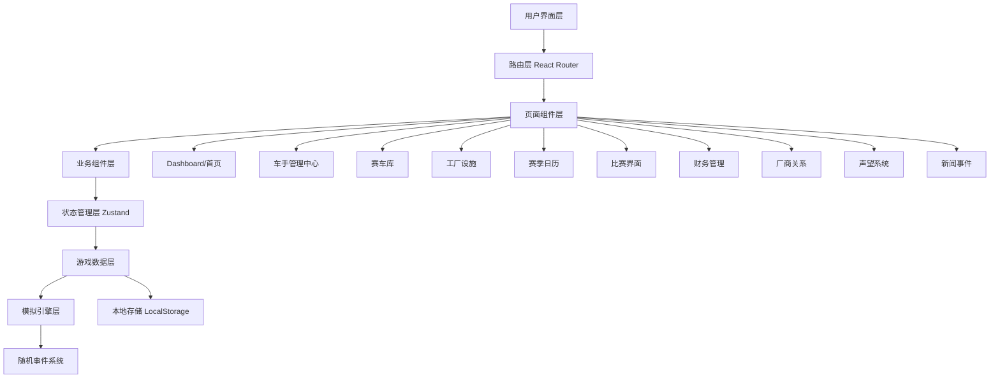

# GT3赛车经营模拟游戏 - 技术架构文档

## 1. 架构设计

### 1.1 整体架构


### 1.2 技术栈选择理由

**为什么选择 React + TypeScript + Vite**：
- TypeScript 提供强类型系统，适合复杂游戏数据模型
- Vite 快速热更新，提升开发效率
- React 组件化架构，便于管理复杂UI
- Zustand 轻量级状态管理，比Redux更适合游戏状态

**为什么不用后端**：
- 单机游戏本质，无需实时多人
- LocalStorage 足够存储游戏存档
- 简化部署，用户直接运行
- 降低复杂度，专注游戏逻辑

---

## 2. 技术选型详情

### 2.1 核心依赖
```json
{
  "react": "^18.2.0",
  "react-dom": "^18.2.0",
  "react-router-dom": "^6.20.0",
  "zustand": "^4.4.7",
  "typescript": "^5.3.0",
  "vite": "^5.0.0",
  "tailwindcss": "^3.3.0",
  "lucide-react": "^0.294.0",
  "clsx": "^2.0.0"
}
```

### 2.2 项目结构
```
/workspace/
├── src/
│   ├── components/          # 可复用组件
│   │   ├── common/         # 通用组件（按钮、卡片、徽章）
│   │   ├── dashboard/      # 仪表盘组件
│   │   ├── drivers/        # 车手相关组件
│   │   ├── cars/           # 赛车相关组件
│   │   ├── race/           # 比赛相关组件
│   │   └── finance/        # 财务相关组件
│   ├── pages/              # 页面组件
│   │   ├── Dashboard.tsx   # 首页/仪表盘
│   │   ├── Drivers.tsx     # 车手管理
│   │   ├── Garage.tsx      # 赛车库
│   │   ├── Facilities.tsx  # 设施升级
│   │   ├── Calendar.tsx    # 赛季日历
│   │   ├── Race.tsx        # 比赛界面
│   │   ├── Finance.tsx     # 财务中心
│   │   ├── Manufacturer.tsx # 厂商关系
│   │   ├── Reputation.tsx  # 声望系统
│   │   └── News.tsx        # 新闻事件
│   ├── stores/             # Zustand状态库
│   │   ├── gameStore.ts    # 游戏主状态
│   │   ├── driverStore.ts  # 车手状态
│   │   ├── carStore.ts     # 赛车状态
│   │   ├── raceStore.ts    # 比赛状态
│   │   └── financeStore.ts # 财务状态
│   ├── engine/             # 游戏引擎
│   │   ├── raceEngine.ts   # 比赛模拟引擎
│   │   ├── bopEngine.ts    # BoP计算引擎
│   │   ├── economyEngine.ts # 经济计算引擎
│   │   └── eventEngine.ts  # 事件生成引擎
│   ├── data/               # 静态数据
│   │   ├── drivers.ts      # 车手数据
│   │   ├── cars.ts         # 赛车数据
│   │   ├── tracks.ts       # 赛道数据
│   │   ├── seasons.ts      # 赛季数据
│   │   └── events.ts       # 事件模板
│   ├── types/              # TypeScript类型定义
│   │   ├── driver.ts       # 车手类型
│   │   ├── car.ts          # 赛车类型
│   │   ├── race.ts         # 比赛类型
│   │   ├── finance.ts      # 财务类型
│   │   └── game.ts         # 游戏通用类型
│   ├── utils/              # 工具函数
│   │   ├── calculations.ts # 数值计算
│   │   ├── format.ts       # 格式化函数
│   │   └── random.ts       # 随机数生成
│   ├── App.tsx             # 根组件
│   ├── main.tsx            # 入口文件
│   └── index.css            # 全局样式
├── public/                 # 静态资源
├── .trae/documents/        # 项目文档
├── package.json
├── tsconfig.json
├── vite.config.ts
├── tailwind.config.js
└── README.md
```

---

## 3. 路由定义

### 3.1 路由结构
| 路由 | 页面名称 | 功能描述 |
|------|----------|----------|
| `/` | Dashboard | 车队总览、快捷入口 |
| `/drivers` | Drivers | 车手签约、解约、属性查看 |
| `/garage` | Garage | 赛车库、购买、维护 |
| `/facilities` | Facilities | 设施升级 |
| `/calendar` | Calendar | 赛季日历、赛历浏览 |
| `/race/:raceId` | Race | 比赛界面（动态路由） |
| `/finance` | Finance | 财务中心、交易记录 |
| `/manufacturer` | Manufacturer | 厂商关系、厂商商店 |
| `/reputation` | Reputation | 声望系统详情 |
| `/news` | News | 新闻事件、随机事件 |

### 3.2 路由守卫
- `/race/:raceId` 需要先在日历报名才能访问
- `/garage` 需要有足够资金才能购买赛车
- 其他页面无特殊限制

---

## 4. 数据模型定义

### 4.1 核心类型定义

#### 4.1.1 车手类型 (Driver)
```typescript
interface Driver {
  id: string;
  name: string;
  nationality: string;
  age: number;
  rating: 'platinum' | 'gold' | 'silver' | 'bronze';
  skills: {
    technical: number;        // 60-99
    stamina: number;          // 60-99
    pressure: number;         // 1-5 (1=稳定, 5=容易失误)
    wetSkill: number;         // 1-5
    familiarity: number;       // 0-100 与赛车磨合度
  };
  salary: number;             // 每场薪资
  willingness: number;        // 50-100 加盟意愿
  specialties: string[];      // 特殊技能
  contract: {
    signed: boolean;
    remainingRaces: number;
    fee: number;              // 绅士付费金额（负数）
  };
}
```

#### 4.1.2 赛车类型 (Car)
```typescript
interface Car {
  id: string;
  make: string;               // 厂商 (Porsche, Ferrari, Mercedes, etc.)
  model: string;             // 型号 (911 GT3 R, 488 GT3, AMG GT3)
  year: number;
  purchasePrice: number;
  currentCondition: number;   // 0-100 当前状态
  maxCondition: number;      // 最大状态（可升级）
  bop适应性: {
    highSpeed: number;        // 高速赛道BoP表现
    technical: number;         // 技术赛道BoP表现
    endurance: number;        // 耐力赛BoP表现
  };
  raceHistory: RaceResult[];
  maintenanceCost: number;    // 基础维护成本
}
```

#### 4.1.3 比赛类型 (Race)
```typescript
interface Race {
  id: string;
  name: string;
  track: Track;
  type: 'sprint' | 'endurance';
  duration: number;            // 小时数 (2, 12, 24)
  entryFee: number;           // 报名费
  prize: {
    overall: number;          // 全场冠军
    proAm: number;            // Pro-Am冠军
    am: number;               // Am冠军
  };
  bop: BOPConfig;
  date: Date;
  status: 'upcoming' | 'qualifying' | 'racing' | 'finished';
  registeredTeams: string[];
}
```

#### 4.1.4 BoP配置 (BOPConfig)
```typescript
interface BOPConfig {
  weightPenalty: number;       // kg (正值=减速)
  powerRestriction: number;   // % (100=全功率)
  aeroRestriction: number;    // % (100=全下压力)
  published: boolean;          // 是否已公布
}
```

#### 4.1.5 车队类型 (Team)
```typescript
interface Team {
  id: string;
  name: string;
  prestige: number;            // 声望 0-100
  financialReputation: number; // 财务口碑 0-100
  balance: number;            // 当前资金
  drivers: Driver[];          // 当前签约车手
  cars: Car[];                // 拥有的赛车
  facilities: Facilities;
  manufacturer: {
    make: string;
    level: number;            // 1-5
    loyalty: number;           // 忠诚度 0-100
  };
  sponsors: Sponsor[];
}
```

#### 4.1.6 设施类型 (Facilities)
```typescript
interface Facilities {
  workshop: number;           // 1-5
  simulator: number;          // 0-3
  engineeringOffice: number;   // 0-3
  fitnessCenter: number;       // 0-3
  logistics: number;          // 0-3
}
```

#### 4.1.7 财务类型 (Finance)
```typescript
interface FinanceRecord {
  id: string;
  date: Date;
  type: 'income' | 'expense';
  category: 'sponsorship' | 'prize' | 'salary' | 'maintenance' | 'purchase' | 'facility' | 'travel' | 'entry';
  amount: number;
  description: string;
}
```

#### 4.1.8 事件类型 (GameEvent)
```typescript
interface GameEvent {
  id: string;
  type: 'random' | 'milestone' | 'moral';
  title: string;
  description: string;
  choices?: {
    label: string;
    effects: Effect[];
  }[];
  effects?: Effect[];
  occurred: boolean;
  date: Date;
}
```

---

## 5. 状态管理设计

### 5.1 主游戏状态 (gameStore)
```typescript
interface GameState {
  // 游戏进度
  currentSeason: number;
  currentRaceWeek: number;
  gamePhase: 'offseason' | 'preseason' | 'season' | 'postseason';
  
  // 车队数据
  team: Team;
  
  // 赛季数据
  seasonCalendar: Race[];
  raceResults: RaceResult[];
  
  // 当前状态
  currentRace: Race | null;
  activeEvents: GameEvent[];
  
  // 操作
  advanceWeek: () => void;
  registerForRace: (raceId: string) => void;
  signDriver: (driverId: string) => void;
  // ... 更多操作
}
```

### 5.2 比赛状态 (raceStore)
```typescript
interface RaceState {
  // 比赛配置
  selectedCar: Car | null;
  selectedDrivers: Driver[];
  strategy: RaceStrategy;
  
  // 实时状态
  raceProgress: number;        // 0-100
  currentPosition: number;
  pitStops: number;
  tireCondition: number;
  fuelLoad: number;
  
  // 比赛日志
  raceLog: RaceEvent[];
  
  // 操作
  startRace: () => void;
  makePitStop: (config: PitStopConfig) => void;
  issueCommand: (command: RaceCommand) => void;
}
```

---

## 6. 核心引擎设计

### 6.1 比赛模拟引擎 (raceEngine)

#### 6.1.1 输入参数
- 车手属性（技术、体能、压力系数）
- 赛车性能（基础性能 × BoP调整 × 条件）
- 策略选择（轮胎、燃油、指令）
- 随机因素（天气、安全车、对手表现）

#### 6.1.2 核心算法
```
单圈时间 = 基础时间 
         × (1 - 技术加成) 
         × (1 + BoP惩罚) 
         × (1 + 体能消耗) 
         × (1 + 失误惩罚) 
         × 随机因素
```

#### 6.1.3 模拟流程
1. 生成排位赛结果（基于车手技能 + 赛车性能）
2. 正赛分段模拟（每段5-10分钟）
3. 进站窗口判断
4. 安全车/天气事件触发
5. 疲劳累积计算
6. 最终名次结算

### 6.2 BoP引擎 (bopEngine)

#### 6.2.1 BoP计算
```typescript
function calculateBOP(car: Car, track: Track, bopConfig: BOPConfig): number {
  const basePerformance = car.basePerformance;
  
  const weightEffect = 1 - (bopConfig.weightPenalty * 0.002);
  const powerEffect = bopConfig.powerRestriction / 100;
  const aeroEffect = bopConfig.aeroRestriction / 100;
  
  const trackAdaptation = track.type === 'highSpeed' 
    ? car.bop适应性.highSpeed 
    : track.type === 'technical'
    ? car.bop适应性.technical
    : car.bop适应性.endurance;
  
  return basePerformance * weightEffect * powerEffect * aeroEffect * trackAdaptation;
}
```

### 6.3 经济引擎 (economyEngine)

#### 6.3.1 收入计算
- 绅士付费：固定金额
- 赞助商：按赛季支付
- 奖金：名次 × 组别倍数

#### 6.3.2 支出计算
- 车手薪资：按场次
- 维护费用：基于损坏程度
- 物流成本：基于距离 × 设施加成
- 报名费：固定

### 6.4 事件引擎 (eventEngine)

#### 6.4.1 事件触发条件
- 随机事件：每场比赛前5%概率
- 里程碑事件：达成特定条件触发
- 道德抉择：根据当前情况动态生成

#### 6.4.2 事件效果
- 声望变化
- 财务影响
- 车手状态变化
- 解锁/关闭选项

---

## 7. 关键算法

### 7.1 车手表现计算
```typescript
function calculateDriverPerformance(
  driver: Driver,
  car: Car,
  track: Track,
  conditions: RaceConditions
): number {
  const skillFactor = driver.skills.technical / 100;
  const familiarityFactor = driver.skills.familiarity / 100;
  const pressureFactor = 1 - (driver.skills.pressure * 0.05);
  
  let weatherBonus = 1;
  if (conditions.weather === 'rain' && driver.skills.wetSkill > 3) {
    weatherBonus = 1.1;
  }
  
  const nightPenalty = conditions.isNight ? 0.95 : 1;
  const fatiguePenalty = 1 - (driver.fatigue * 0.01);
  
  return (skillFactor * 0.5 + familiarityFactor * 0.3) 
         * pressureFactor * weatherBonus * nightPenalty * fatiguePenalty;
}
```

### 7.2 进站时机优化
```typescript
function optimalPitWindow(
  raceLength: number,
  tireLife: number,
  fuelStrategy: 'light' | 'medium' | 'heavy',
  currentPosition: number,
  safetyCarProbability: number
): { lap: number; confidence: number } {
  // 基于当前形势和策略计算最优进站窗口
  // 返回建议圈数和信心指数
  return { lap: 0, confidence: 0 };
}
```

### 7.3 疲劳累积计算
```typescript
function calculateFatigue(
  stintLength: number,
  driverStamina: number,
  conditions: RaceConditions
): number {
  const baseFatigue = stintLength * 0.1;
  const staminaEffect = 1 - (driverStamina / 200);
  const weatherEffect = conditions.weather === 'hot' ? 1.2 : 1;
  const nightEffect = conditions.isNight ? 1.1 : 1;
  
  return baseFatigue * staminaEffect * weatherEffect * nightEffect;
}
```

---

## 8. 数据存储策略

### 8.1 LocalStorage 结构
```typescript
{
  "gt3_manager_save": {
    version: "1.0",
    timestamp: Date,
    gameState: GameState,
    raceHistory: RaceResult[],
    achievements: Achievement[]
  }
}
```

### 8.2 自动保存机制
- 每场比赛结束后自动保存
- 赛季切换时强制保存
- 提供手动保存/读取功能

---

## 9. 性能优化考虑

### 9.1 React 优化
- 使用 React.memo 优化组件重渲染
- 使用 useMemo 和 useCallback 缓存计算结果
- 懒加载非核心页面组件

### 9.2 比赛模拟优化
- 使用 requestAnimationFrame 控制模拟速度
- 批量更新UI状态
- 使用 Web Worker 处理复杂计算（如果需要）

---

## 10. 可扩展性设计

### 10.1 未来功能扩展
- 多人联机模式（需要后端支持）
- 更多赛事系列（IMSA, Asian GT）
- 历史模式（回溯过往赛季）
- 车手养成系统

### 10.2 数据驱动设计
- 所有车手、赛车、赛道数据独立存储
- 易于添加新内容
- 配置化的事件系统
